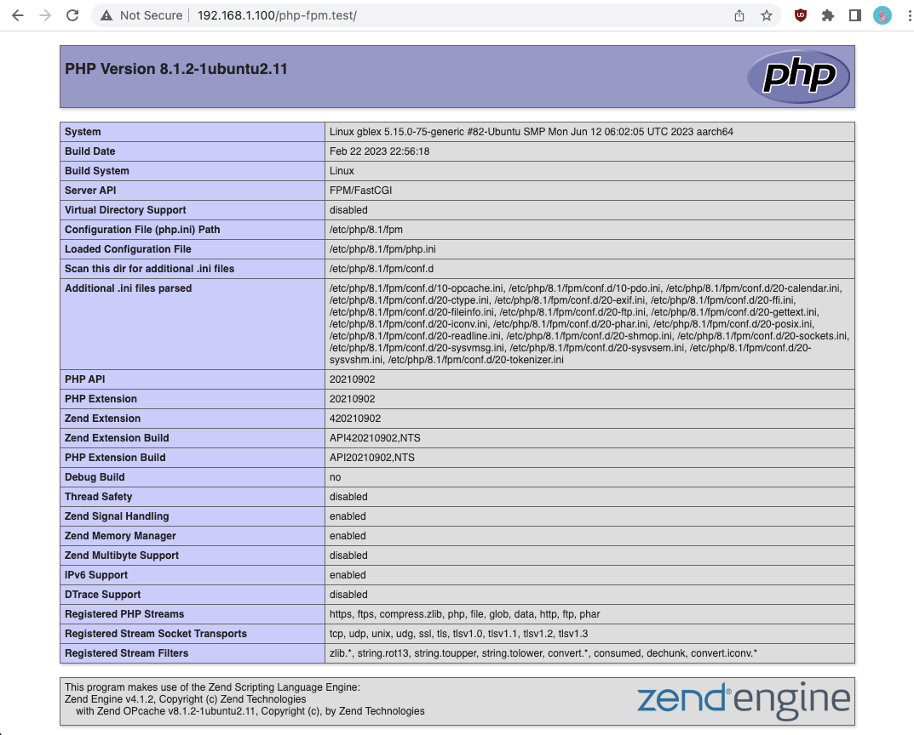

# 1 Установить Nginx и настроить его на работу с PHP-FPM.

установим ngnix

```
sudo apt install nginx
```

проверим что он запустился в процессах

```
ps afx | grep nginx
```

проверим что он слушает порт 80 по дефолту

```
ss -ntlp
```

```
ip a
192.168.1.100
```

наша виртуальная машина торчит наружу по IP 192.168.1.100
Снаружи в браузере заходим на адрес 192.168.1.100:80 и попадаем на приветственную страницу nginx


посмотрим на папку nginx

```
ls -l /etc/nginx
cat /etc/nginx/ngnix.conf
```

основные настройки

```
user www-data;
worker_processes auto;
pid /run/nginx.pid;
include /etc/nginx/modules-enabled/*.conf;

events {
	worker_connections 768;
	# multi_accept on;
}

http {

	##
	# Basic Settings
	##

	sendfile on;
	tcp_nopush on;
	types_hash_max_size 2048;
	# server_tokens off;

	# server_names_hash_bucket_size 64;
	# server_name_in_redirect off;

	include /etc/nginx/mime.types;
	default_type application/octet-stream;

	##
	# SSL Settings
	##

	ssl_protocols TLSv1 TLSv1.1 TLSv1.2 TLSv1.3; # Dropping SSLv3, ref: POODLE
	ssl_prefer_server_ciphers on;

	##
	# Logging Settings
	##

	access_log /var/log/nginx/access.log;
	error_log /var/log/nginx/error.log;

	##
	# Gzip Settings
	##

	gzip on;

	##
	# Virtual Host Configs
	##

	include /etc/nginx/conf.d/*.conf;
	include /etc/nginx/sites-enabled/*;
}
```

```
cat /etc/nginx/sites-available/default
```

настройки сайтов

```
server {
listen 80 default_server;
listen [::]:80 default_server;

    root /var/www/html;

    server_name _;

    location / {
    	try_files $uri $uri/ =404;
    }

}
```

посмотрим на папку с сайтами

```
ls -l /var/www/html
```

установим PHP по дефолту для нашей ОСи

```
sudo apt install php
```

узнаем версию PHP

```
php -v
PHP 8.1.2-1ubuntu2.11
```

по известной версии установим доп модуль php-fpm для nginx чтобы обрабатывать скрипты php

```
sudo apt install php8.1-fpm
```

посмотрим папку /etc/php/8.1/fpm/pool.d с настройками php-fpm

```
ls -l /etc/php/8.1/fpm/pool.d
cat /etc/php/8.1/fpm/pool.d/www.conf
```

находим в файле unixsocket, который надо слушать в nginx для php-скриптов

```
listen = /run/php/php8.1-fpm.sock
```

смотрим, что в nginx есть доп модуль fastcgi-php

```
/etc/nginx/snippets/fastcgi-php.conf
```

Переходим в настройки сайтов в nginx

```
cd /etc/nginx/sites-available/
```

редактируем на основе полученной информации про юникс-сокет конфиг nginx

```
sudo nano default
```

добавляем туда файлы index.php
добавляем обработку pph-скриптов через FastCGI server
добавляем отдачу статики

```
# Add index.php to the list if you are using PHP
index index.html index.htm index.php index.nginx-debian.html;

# pass PHP scripts to FastCGI server
location ~ \.php$ {
	include snippets/fastcgi-php.conf;
	root /var/www/html;
	fastcgi_pass unix:/run/php/php8.1-fpm.sock;
}

# Static query
location ~* ^.+.(jpg|jpeg|gif|png|ico|css|zip|pdf|txt|tar|js)$ {
  root /var/www/html;
}
```

```
sudo nginx -t
nginx: the configuration file /etc/nginx/nginx.conf syntax is ok
nginx: configuration file /etc/nginx/nginx.conf test is successful
```

Создадим новый сайт php-fpm.test
Сделаем для него папку в /var/www/html
сайты там можно раскладывать по папкам

```
cd /var/www/html

mkdir php-fpm.test
cd php-fpm.test/
```

для сайта создадим индексный файл index.php

```
sudo touch index.php
sudo nano index.php
```

напишем код в файле на выдачу phpinfo()

```
<?php
	phpinfo();

```

Снаружи в браузере заходим на адрес 192.168.1.100:80/php-fpm.test/ и попадаем на приветственную страницу phpinfo(). Это отработал nginx в связке с php-fpm

