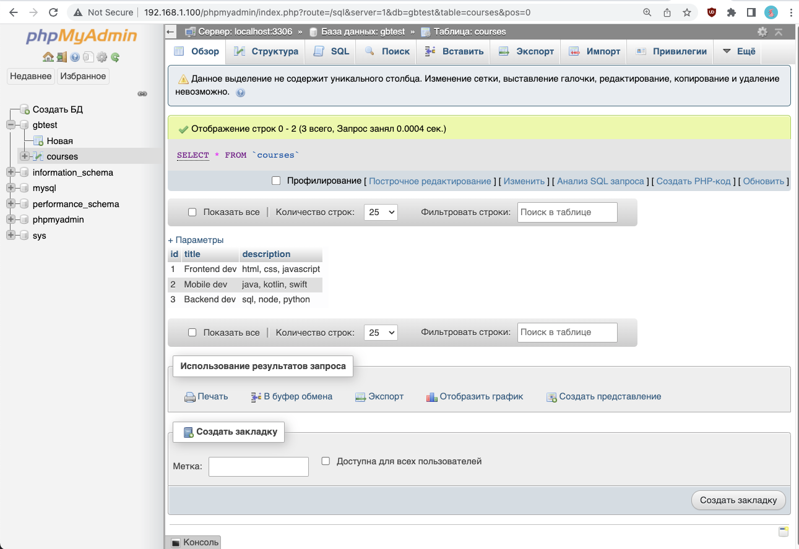

# 5 Установить пакет phpmyadmin и запустить его веб-интерфейс для управления MySQL.

Пакет phpmyadmin ставится из стандартного репозитория простой командой

```bash
sudo apt update
sudo apt install phpmyadmin
```

Но по дефолту автоматом можно поставить его для двух серверов
**apache2**
**lighttpd**

Современные тренды веб разработки предлагают **отказаться на локальной машине** от громоздкого сервера **apache** и обойтись сервером nginx.

Поэтому при установке **phpmyadmin** не надо выбирать никаких серверов, если там нет **nginx**. Остальное можно ставить по дефолту. Обратить внимание на запрос пароля, его спрашивает программа установки.

Для разработки сайтов с бэкендом на PHP рекомендуется поставить на локальную машину связку

**nginx + php-fpm + PHP + MySQL + phpmyadmin**

В предыдущих частях урока уже установлены все программы, кроме **phpmyadmin**, поэтому сейчас надо остановить **apache** и вернуть настройки **nginx** для обработки php-скриптов на **PHP FASTCGI**.

**nginx** должен работать так, как он был настроен в первой части "1-nginx-php".

После установки программа **phpmyadmin** разворачивается в папке **/usr/share/phpmyadmin/** и сервер его не видит, хоть nginx, хоть apache - они в одной папке в простом случае по дефолту. И в этом случае в ОСи одна папка с веб-сервером.

Папка веб-сервера находится в **/var/www/html/** и туда нужно положить символьную ссылку (Symbolic link, symlink, симлинк) на **phpmyadmin** чтобы сервер его увидел. Команда

```bash
sudo ln -s /usr/share/phpmyadmin/ /var/www/html/
```

Тогда по адресу **localhost/phpmyadmin** можно будет увидеть страницу с приглашением ввода логина и пароля. Это если ngnix успешно работает на адресе **localhost**.

Но зайти в **phpmyadmin** просто так не получится, потому, что **mysql** тоже надо настроить для работы с ним.
Нужен **user** с паролем и привилегиями на все объекты в **mysql** - это все БД, все таблицы в них и т.д.

Установку юзера, пароля и привилегий делаем не просто в терминале, а надо зайти в программу **mysql** - это было в четвертой части урока "4-mysql".

Юзера можно настроить двумя способами:

- как уже существующий root и дать ему все
- создать нового юзера, с новым именем и т.д. и дать ему все привилегии.

root лучше не трогать. Он по дефолту инсталлируется без пароля, чтоб можно было зайти на mysq в терминале. Там ведь через sudo юзер именуется тоже root и поэтому они пароль не поставили, чтоб не морочиться.
И для спокойной работы с mysql в терминале лучше оставить root в покое и ничего по нему не менять.

Именно поэтому настоятельно советуют создать для БД и phpmyadmin отдельного юзера, дать ему все привилегии и с ним ходить через браузер в удобный интерфейс.

## Создание специального нового пользователя

Создадим юзера "lex" и дадим ему простой пароль "123" чтобы он ходил через браузер в phpmyadmin-е. Для локальной разработки отлично подойдет.

```sql
sudo mysq
CREATE USER 'lex'@'localhost' IDENTIFIED BY '123';
GRANT ALL PRIVILEGES ON * . * TO 'lex'@'localhost';
FLUSH PRIVILEGES;
exit
```

Готово.

## Для root.

так лучше не делать!!!!
Если тронуть root-а в mysql то потом придется хитро выгнуто заходить в терминале в программу mysql.

```sql
sudo mysq
AlTER USER 'root'@'localhost' IDENTIFIED WITH mysql_native_password BY '123';
exit
```

Если уже запулили команду и поменяли пароль, то проверка юзера и пароля.
появится запрос пароля.
это лучше не трогать и не делать!!!

```sudo
sudo mysql -u root -p
```

и потом наверно постоянно придется так заходить.
Не через простой

```sudo
sudo mysql
```

а через эту длинную запись с указанием имени пользователя и вызовом пароля для него.
Это очень неудобно!!!
Или вообще никак не зайдет, пойдут ошибки.
И ничем не исправишь, даже переустановкой mysql.
Только начисто удалять виртуальную машину.

## Готово

Теперь по адресу **localhost/phpmyadmin** можно зайти в **phpmyadmin** и работать в нем. Если сервер торчит наружу, то вместо localhost указать его IP-address либо dns-name если есть.


Проверить статусы процессов, у нас их несколько nginx, mysql, php-fpm, phpmyadmin

```sudo
systemctl status phpmyadmin
```

Рестартануть процесс

```sudo
systemctl reload nginx
```

или

```sudo
systemctl restart nginx
```
